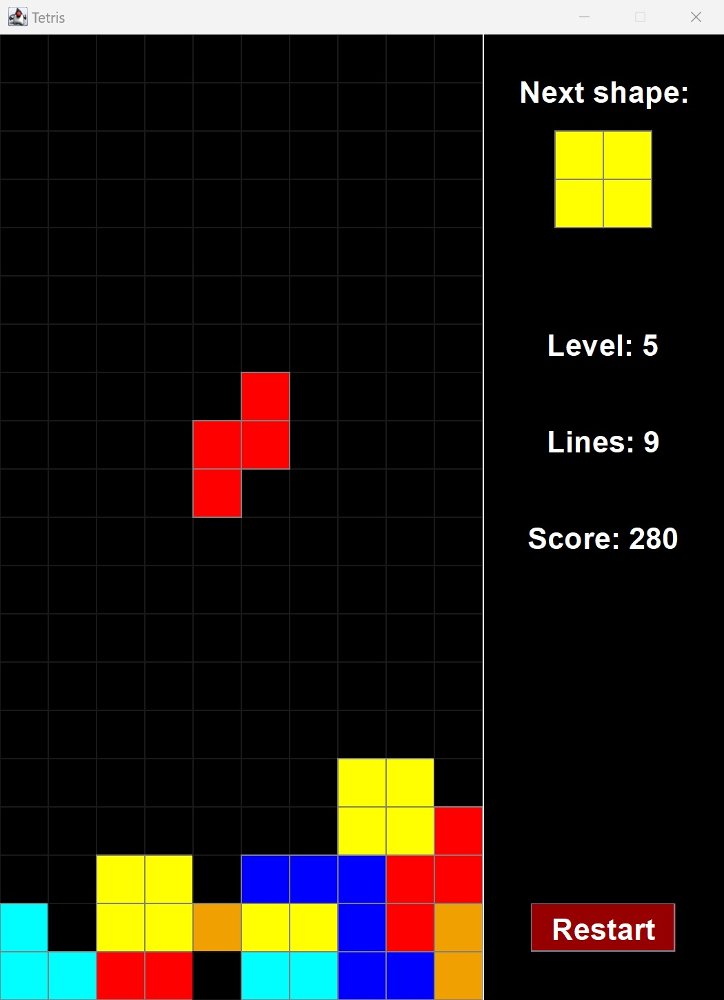

# DD1385 Software Engineering (Java)
All laboratory assignments, Lab1-Lab5, and the final project for the course DD1385 Software Engineering at KTH. I took the course in period 2 in the fall of 2023 and received an A on both the laboratory assignments and the final project.

## Overview of laboratory assignments
* **Lab1:** A program with two independent buttons. Three versions, version A, B and C, corresponding to different design strategies.
  
* **Lab2:** The game *fifteenmodel*, which is essentially a slide puzzle with 16 slides and numbers 1-15 (plus and empty slide). The Model-ViewController (M-VC) design pattern has been used, so the game can be played via both a graphical interface and the command line. In addition, there is a mock object for the implementation of the game Tic-Tac-Toe.
  
* **Lab3:** Server-client graphical implementation of the game Rock Paper Scissors, where any number of users (clients) can play against a computer server at any given time.
  
* **Lab4:** In part 1, a suitcase is constructed using the composite design pattern, meaning that the suitcase itself is of the type composite and that its contents can be both of type leaf and composite. At runtime, the weight and name of the suitcase and its contents are printed out. For the composite class, both a depth-first and a breadth-first iterator has been implemented. Part 2 of the lab contains a small example of the factory design pattern.
  
* **Lab5:** Window displaying hierarchical tree structure, created by parsing XML.
  
* **Lab6:** Two custom classes for a set with ordered items, implementing the same interface and thereby having the same functionality. Specifically, the class *SparseVec2A* has a TreeMap as an instance variable whereas the class *SparseVec2B* inherits from the TreeMap class. Based on the JUnit framework, the class *SparseVecTreeTest* is designed to test the functionality of the two classes.

## Final Project: Implementation of the game Tetris
As the final project of the course, the game Tetris was implemented according to the UML diagram and screenshot shown below. Note that the UML diagram only includes public methods. As in lab 2, the Model-ViewController (M-VC) design pattern was used.

The behavior of the game is mostly self-explanatory. For example, the left, right, up and down arrow buttons work just as one would expect. One less obvious detail is that the user can pause and then resume the game by pressing either P or the space button. With each new level, the game becomes more difficult in that the blocks fall faster. This is implemented by reducing the sleep time in the Tetris class, whereas the level the user is at depends on the number of cleared lines.

